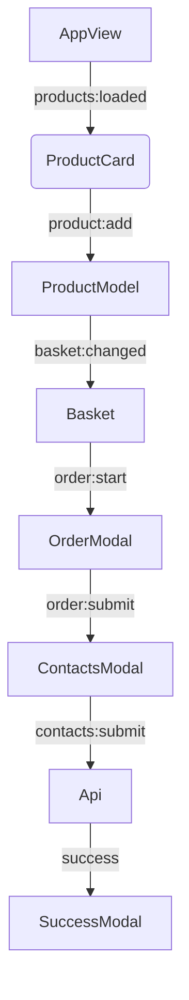

# Проектная работа "Веб-ларек"

Стек: HTML, SCSS, TS, Webpack

Структура проекта:
- src/ — исходные файлы проекта
- src/components/ — папка с компонентами приложения
- src/components/base/ — папка с базовым кодом (Api, Component, EventEmitter)
- src/components/Common/ — общие компоненты, включая модальные окна (Modal, Form, ProductComponent)
- src/components/models/ — папка с моделями данных и API (ProductModel, MarketApi)
- src/components/View/ — папка с файлами представления (PageView, ProductCard, Basket, и др.)
- src/pages/ — папка с HTML-шаблонами и страницами
- src/types/ — типы и интерфейсы для TypeScript
- src/utils/ — утилиты и константы


Важные файлы:
- src/pages/index.html — HTML-файл главной страницы
- src/types/index.ts — файл с типами
- src/index.ts — точка входа приложения
- src/scss/styles.scss — корневой файл стилей
- src/utils/constants.ts — файл с константами
- src/utils/utils.ts — файл с утилитами
- src/components/Components.ts — Базовый абстрактный класс для UI. Предоставляет утилиты для DOM
- src/components/base/events.ts — Брокер событий. Не хранит состояние, только маршрутизирует.
- src/components/base/api.ts — базовый класс для работы с API


## Установка и запуск
Для установки и запуска проекта необходимо выполнить команды

```
npm install
npm run start
```

или

```
yarn
yarn start
```
## Сборка

```
npm run build
```

или

```
yarn build
```

## Архитектура проекта
------ 
### Основные части архитектуры
Архитектура проекта следует упрощенной MVC-подобной структуре (Model-View-Controller через события), с разделением на слои: **Данные (Data Layer)**, **Модели (Model Layer)**, **Представления (View Layer)**, **События (Events Layer)** и **Утилиты (Utils)**. Это веб-приложение для онлайн-магазина с каталогом продуктов, корзиной, оформлением заказа и модальными окнами.

- **Данные (Data Layer)**: Классы для взаимодействия с внешним API (загрузка продуктов, отправка заказов). Использует HTTP-запросы и кэширование.
- **Модели (Model Layer)**: Управление состоянием приложения (каталог, корзина, заказ). Хранит и обновляет данные, но не выполняет сетевые запросы (это делегировано Data Layer).
- **Представления (View Layer)**: UI-компоненты для отображения (страница каталога, модальные окна, карточки продуктов). Рендерят DOM на основе данных.
- **События (Events Layer)**: Центральный механизм коммуникации — EventEmitter для асинхронного обмена событиями между слоями (Observer-паттерн).
- **Утилиты (Utils)**: Вспомогательные функции для DOM-манипуляций, валидации и констант (не часть core-архитектуры, но поддерживают все слои).

### Зачем нужны эти части и их функции
- **Данные**: Обеспечивает загрузку/сохранение данных с сервера (продукты, заказы). Функции: GET/POST-запросы, обработка ошибок, кэширование для производительности.
- **Модели**: Централизует состояние приложения, предотвращая дублирование данных. Функции: добавление/удаление в корзину, расчет суммы, валидация форм, уведомление о изменениях через события.
- **Представления**: Отвечает за пользовательский интерфейс. Функции: рендеринг HTML-шаблонов, обработка пользовательских взаимодействий (клики, ввод), обновление DOM без перезагрузки.
- **События**: Декуплирует компоненты, позволяя loose coupling. Функции: подписка/эмиссия событий (например, 'basket:changed' для обновления UI).
- **Утилиты**: Упрощает повторяющиеся задачи. Функции: селекторы DOM (`ensureElement`), клонирование шаблонов, BEM-генерация классов, константы (API_URL, CDN_URL).

### Как части взаимодействуют
Взаимодействие асинхронное и event-driven: 
- Data Layer загружает данные и эмитирует события (например, 'products:loaded') в Events Layer.
- Model Layer подписывается на события, обновляет состояние и эмитирует свои (например, 'basket:changed').
- View Layer подписывается на события от Model, рендерит/обновляет UI и эмитирует события о действиях пользователя (например, 'product:add' при клике).
- Нет единого контроллера; вместо этого — promise-based flow для API (async/await в `index.ts`) и события для UI-логики. Цикл: Пользователь → View → Event → Model/Data → Event → View.
- Пример: Клик на карточку → 'productModal:open' → Model проверяет состояние → View рендерит модалку.


## Базовые классы
### EventEmitter
Реализует паттерн Наблюдатель для работы с событиями:
- Подписка (on), отписка (off), эмиссия (emit).
- Поддержка wildcard (*) и RegExp для гибкости.

### Api
Базовый класс для HTTP-запросов:
- GET/POST-запросы, обработка ответов, настройка заголовков.

### Modal
Базовый класс модальных окон:
- Открытие/закрытие, управление контентом, обработка Esc/клик вне области.

### Component
Абстрактный базовый класс для UI-компонентов:
- Методы: setText, setImage, toggleClass, setDisabled, render.

### Form
Абстрактный класс для форм:
- Обработка input, валидация, эмиссия событий (submit, change).

## Основные компоненты
### ProductModel
Управление состоянием приложения:
- Хранит каталог, корзину, заказ.
- Методы: addToBasket, removeFromBasket, validateOrderForm, updateOrderTotal.

### PageView
Отображение главной страницы:
- Рендерит галерею товаров, счетчик корзины.
- Сеттеры: productList, count, locked.

### Basket
Компонент корзины:
- Отображает список товаров, общую сумму, кнопку оформления.
- Методы: createBasketModal, set basketListItem, set orderTotalPrice.

### ProductCard
Карточка товара в каталоге:
- Отображает продукт, эмитит событие при клике.
- Сеттеры: title, price, category, image.

### ProductPreview
Модальное окно просмотра товара:
- Детальное отображение, кнопка добавления/удаления.
- Сеттеры: title, price, category, image, description, inBasket.

### OrderView
Форма оформления заказа:
- Выбор оплаты, ввод адреса, валидация.
- Сеттеры: payment, address.

### ContactsView
Форма контактных данных:
- Ввод email/телефона, валидация.
- Сеттеры: email, phone.

### SuccessView
Окно успешного оформления:
- Отображает сумму, кнопку закрытия.
- Сеттер: total.


### Взаимодействие компонентов



## Данные в приложении
Данные типизированы через TypeScript-интерфейсы в `types/index.ts`. Основные типы:

- **Product**: Описывает товар. Поля: `id: string` (уникальный идентификатор), `title: string` (название), `description: string` (описание), `price: number | null` (цена в "синапсах", null для бесплатных), `category: string` (тип: 'хард-скил', 'софт-скил' и т.д.), `image: string` (путь к изображению). Функция: Хранит информацию о продукте для каталога/корзины.
- **Order**: Описывает заказ. Поля: `payment?: 'card' | 'cash'` (способ оплаты), `address?: string` (адрес доставки), `email?: string` (email покупателя), `phone?: string` (телефон), `items?: string[]` (массив ID продуктов), `total: number` (общая сумма). Функция: Собирает данные для оформления и отправки на сервер.
- **ApiListResponse<T>**: Ответ API для списков. Поля: `total: number` (общее количество), `items: T[]` (массив элементов, T — Product). Функция: Стандартизирует пагинированные ответы от сервера.
- **AppState**: Глобальное состояние. Поля: `catalog: Product[]` (список всех продуктов), `basket: Product[]` (корзина), `preview: Product | null` (текущий просматриваемый продукт), `order: Order` (данные заказа). Функция: Централизует все данные приложения для реактивных обновлений.

Данные загружаются из API (`/product`), кэшируются в Model, обновляются через события. Валидация: Простая (проверка длины строк в Model).


### Как части взаимодействуют
Взаимодействие асинхронное и event-driven: 
- Data Layer загружает данные и эмитирует события (например, 'products:loaded') в Events Layer.
- Model Layer подписывается на события, обновляет состояние и эмитирует свои (например, 'basket:changed').
- View Layer подписывается на события от Model, рендерит/обновляет UI и эмитирует события о действиях пользователя (например, 'product:add' при клике).
- Нет единого контроллера; вместо этого — promise-based flow для API (async/await в `index.ts`) и события для UI-логики. Цикл: Пользователь → View → Event → Model/Data → Event → View.
- Пример: Клик на карточку → 'productModal:open' → Model проверяет состояние → View рендерит модалку.

## Компоненты приложения
Приложение состоит из базовых классов, моделей и view-компонентов. Каждый класс — на одном слое, следует SRP: View — только рендеринг/DOM, Model — состояние (без API-запросов), Data — сетевые операции (без хранения UI-логики).

### Паттерн проектирования
Применяется **Event-Driven Architecture** с **Observer Pattern** (EventEmitter как publisher/subscriber). Это упрощенная **MVC**: Model (ProductModel) управляет данными, View (компоненты) — отображением, Controller — события в `index.ts` (подписки/эмиссия). Дополнено **Template Method** (базовый `Component.render`) и **Composite** (модалки с вложенным контентом).


### Описание классов по слоям
#### Data Layer (взаимодействие с внешними данными)
- **Api** (base/api.ts): Базовый HTTP-клиент. Слой: Data. Задача: Выполняет GET/POST-запросы, обрабатывает ответы/ошибки. Не хранит данные, только проксирует fetch.
- **MarketApi** (models/ProductApi.ts): Специализированный API для магазина. Слой: Data. Задача: Загружает продукты (`getProduct`), отправляет заказы (`buyProduct`), кэширует продукты локально. Эмитирует события об успехе/ошибке.

#### Events Layer (коммуникация)
- **EventEmitter** (base/events.ts): Брокер событий. Слой: Events. Задача: Подписка (`on`), инициация (`emit`), отписка (`off`). Поддерживает wildcard и RegExp для гибкости. Не хранит состояние, только маршрутизирует.

#### Model Layer (состояние и бизнес-логика)
- **ProductModel** (models/ProductModel.ts): Менеджер состояния. Слой: Model. Задача: Хранит/обновляет AppState (каталог, корзина, заказ), методы для манипуляций (addToBasket, removeFromBasket, validateInputs). Эмитирует события о изменениях. Не выполняет API-запросы (только получает данные извне).
Методы детальнее:
- (`addToBasket`) — Добавляет товар в корзину;
- (`removeFromBasket`) — Удаляет товар из корзины;
- (`setProducts`) — Получает данные из каталога;
- (`clearBasket`) — Очищает корзину;
- (`isInBasket`) — Проверяет наличие товара в корзине;
- (`setOrderField`) — устанавливает поле, валидирует, эмитирует 'order:ready' если валидно.
- (`successOrder(): IOrder`) — формирует полный заказ (total, items).
- и т.д.

#### View Layer (UI-компоненты, наследуют от Component)
- **Component** (base/Component.ts): Базовый абстрактный класс для UI. Слой: View (base). Задача: Предоставляет утилиты для DOM (setText, setImage, toggleClass). Абстрактный `render` для рендеринга. Не хранит данные, только манипулирует элементами. Основные методы:
- (`setDisabled`) — Изменяет статус блокировки кнопок;
- (`render`) — Возвращает DOM-элемент;
- (`toggleClass`) — Переключает класс элемента;


- **Modal** (Common/Modal.ts): Базовый модал. Слой: View. Задача: Открытие/закрытие модалки, управление контентом, обработка Esc/кликов. Не рендерит содержимое — только контейнер. Основные методы:
- (`open`) — Открывает модальное окно, позволяет выбрать необходимое содержимое;
- (`close`) — Закрывает модальное окно;
- (`handleEscUp`) — Закрытие модального окна по кнопке Esc;

- **PageView** (View/PageView.ts): Главная страница. Слой: View. Задача: Рендерит галерею продуктов, счетчик корзины, обработка клика по корзине. Обновляется через события. Сеттеры:
- (`productList`) — Обновляет каталог товаров;
- (`recountnder`) — Обновляет отображение товаров в хедере;


- **ProductCard** (View/ProductCard.ts): Карточка товара в каталоге. Слой: View. Задача: Отображает продукт (изображение, цена, категория), эмитирует клик для модалки. Рендерит из шаблона. Сеттеры:
- (`category`) — Отображает категорию товара;
- (`image`) — Отображает картинку и описание картинки товара;

- **ProductPreview** (View/ProductPreview.ts): Модалка просмотра продукта. Слой: View. Задача: Детальный рендер продукта, кнопка добавления/удаления в корзину (зависит от состояния). Обновляет кнопку динамически. Сеттеры:
- (`inBasket`) — Изменяет состояние и события кнопки в зависимости от нахождения товара в корзине;
- (`category`) — Отображает категорию товара;
- (`image`) — Отображает картинку и описание картинки товара;
- (`description`) — Отображает описание товара;


- **Basket** (View/Basket.ts): Модалка корзины. Слой: View. Задача: Рендерит список товаров в корзине, общую сумму, кнопку оформления. Показывает пустую корзину. Основные методы и сеттеры:
- (`createBasketModal`) — Отображает состояние контейнера корзины и переключает состояние кнопки заказа;
- (`createEmptyMessage`) — Отображает сообщение при отсутствии товаров в корзине;
- (`basketListItem`) — Отображает товары в корзине;
- (`orderTotalPrice`) — Отображает общую сумму товаров в корзине;

- **BasketProduct** (View/BasketProduct.ts): Элемент корзины. Слой: View. Задача: Отображает один товар в корзине (индекс, название, цена), кнопка удаления. Сеттеры:
- (`title`) — Отображает название товара;
- (`price`) — Отображает цену товара;

- **OrderView** (View/OrderView.ts): Модалка заказа (оплата/адрес). Слой: View. Задача: Выбор оплаты, ввод адреса, валидация, переход к контактам. Методы:
- Сеттеры: (`payment`) (toggle active класс на button_alt), (`address`) (value input[name="address"]).


- **ContactsModal** (View/ContactsModal.ts): Модалка контактов. Слой: View. Задача: Ввод email/телефона, валидация, сабмит. Показывает ошибки. Методы:
  - Сеттеры: (`email`)/(`phone`) (value input[name])

- **SuccessModal** (View/SuccessModal.ts): Модалка успеха. Слой: View. Задача: Отображает сумму списания, кнопку закрытия. Сеттеры:
- (`total`) — Отображает общую сумму заказа;

## Реализация процессов в приложении
Процессы реализованы **через события (EventEmitter)** для UI-логики и **promise-based flow** для асинхронных операций (API-запросы с async/await). Нет единого контроллера — `index.ts` выступает как инициализатор и оркестратор подписок. 

- **Загрузка продуктов**: `marketApi.getProduct()` (promise) → setProducts в Model → 'product:changed' → рендер PageView.
- **Добавление в корзину**: Клик в View → 'product:add' → Model.addToBasket → 'basket:changed' → обновление BasketModal/PageView.
- **Оформление заказа**: Пошагово через события: 'orderModal:open' → ввод/валидация → 'order:submit' → ContactsModal → 'contacts:submit' → Api.post (promise) → 'order:success' → SuccessModal + clear.
- **Валидация**: Input-ивенты → 'contacts:input'/'validate:inspect' → Model-методы → обновление View (disabled кнопки, ошибки).


Это обеспечивает реактивность: изменения в Model автоматически обновляют View через события, без прямых ссылок между компонентами.

Ссылка на работу: [https://github.com/elmerroom/web-larek-frontend/tree/main]
