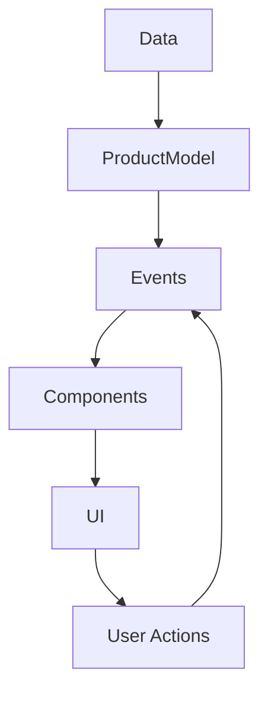
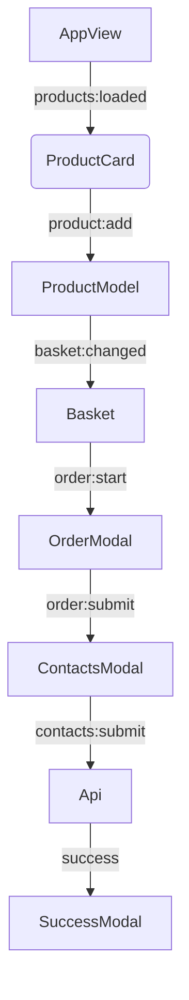

# Проектная работа "Веб-ларек"

Стек: HTML, SCSS, TS, Webpack

Структура проекта:
- src/ — исходные файлы проекта
- src/components/ — папка с JS компонентами
- src/components/base/ — папка с базовым кодом

Важные файлы:
- src/pages/index.html — HTML-файл главной страницы
- src/types/index.ts — файл с типами
- src/index.ts — точка входа приложения
- src/scss/styles.scss — корневой файл стилей
- src/utils/constants.ts — файл с константами
- src/utils/utils.ts — файл с утилитами

## Установка и запуск
Для установки и запуска проекта необходимо выполнить команды

```
npm install
npm run start
```

или

```
yarn
yarn start
```
## Сборка

```
npm run build
```

или

```
yarn build
```

## Архитектура проекта
------ 



### Базовые классы
------ 

### EventEmitter

Реализует паттерн "Наблюдатель" для работы с событиями. Основные функции:

- Подписка/отписка на события (on, off).
- Генерация событий (emit).
- Глобальные обработчики (onAll, offAll).

### Api

РБазовый класс для работы с API. Обеспечивает:

- GET/POST запросы.
- Обработку ответов.
- Конфигурацию заголовков.

### Modal

Базовый класс модальных окон. Функционал:

- Открытие/закрытие модальных окон.
- Управление контентом.
- Обработка кликов вне области.

### Основные компоненты
------ 

### ProductModel

Центральный класс для управления состоянием приложения:

- Загрузка товаров с сервера.
- Управление корзиной (добавление/удаление).
- Хранение данных о текущем заказе.
- Обновление общей суммы.

### AppView

Отвечает за отображение каталога товаров:

- Рендеринг списка товаров.
- Создание карточек товаров.
- Обновление отображения при изменении данных.

### Basket

Компонент корзины:

- Отображение списка товаров.
- Подсчет общей суммы.
- Управление кнопками оформления заказа.
- Взаимодействие с ProductModel через события

### Взаимодействие компонентов




### ProductCard

Компонент карточки товара:

- Отображение информации о товаре.
- Обработка кликов для добавления в корзину.
- Открытие превью товара.

### ProductModal

Модальное окно просмотра товара:

- Детальное отображение информации.
- Кнопка добавления/удаления из корзины.
- Взаимодействие с Basket через события.

### OrderModal

Форма оформления заказа:

- Выбор способа оплаты.
- Ввод адреса доставки.
- Валидация данных.
- Переход к форме контактов.

### ContactsModal

Форма ввода контактных данных:

- Ввод email и телефона.
- Валидация данных.
- Отправка заказа на сервер.

### SuccessModal

Окно успешного оформления:

- Отображение итоговой суммы.
- Кнопка возврата в магазин.

## Взаимодействие компонентов
------ 

1. Поток данных: 
- ProductModel хранит состояние (каталог, корзина, заказ)
- Компоненты подписываются на изменения через EventEmitter
- Пользовательские действия генерируют события

2. Процесс оформления заказа:

```text
Basket -> OrderModal -> ContactsModal -> Api -> SuccessModal
``` 

3. Типы данных:

```typescript
type Product = {
  id: string;
  title: string;
  description: string;
  price: number | null;
  category: string;
  image: string;
};

type Order = {
  payment?: 'card' | 'cash';
  address?: string;
  email?: string;
  phone?: string;
  items?: string[];
  total: number;
};

type AppState = {
  catalog: Product[];
  basket: Product[];
  preview: Product | null;
  order: Order;
};

type ApiListResponse<T> = {
    total: number,
    items: T[]
};
``` 

## Ключевые процессы
------ 

1. Загрузка товаров:
- AppView инициирует загрузку
- ProductModel делает запрос через Api
- При успехе рассылает событие 'products:loaded'

2. Работа с корзиной:
- ProductCard генерирует события добавления
- ProductModel обновляет состояние
- Basket получает обновления через события

3. Оформление заказа:
- Данные собираются пошагово через OrderModal и ContactsModal
- Финальные данные отправляется через Api.post
- При успехе открывается SuccessModal